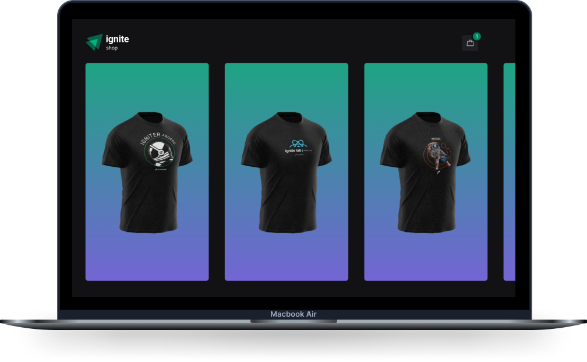

  

 

  

## ✨ Tecnologias

Esse projeto foi desenvolvido com as seguintes tecnologias:

- [Next.js](https://nextjs.org/)
- [TypeScript](https://www.typescriptlang.org/)
- [Stripe](https://stripe.com/)
- [Axios](https://axios-http.com/docs/intro)
- [Stitches](https://stitches.dev/)
- [Radix UI](https://www.radix-ui.com/)
- [Keen Slider](https://keen-slider.io/)
- [Phosphor React](https://github.com/phosphor-icons/phosphor-react)

## 🚀 Como executar

- Clone o repositório
- Instale as dependências com `yarn`
- Inicie o servidor com `yarn dev`

Agora você pode acessar [`localhost:3000`](http://localhost:3000) do seu navegador.

---

Feito com ♥ por Renato Silva 👋🏻
